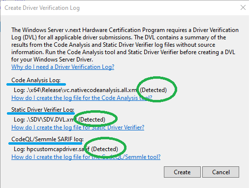

# HP OMEN Driver (base of HP device driver)

Refer below source code.
https://github.azc.ext.hp.com/PSSW/win-drv-hpcustomcapdriver/blob/master/hpcustomcapdriver/hpcustomcapdriver.c


# How to generate Driver Verification Log (DVL)

The DVL is comprised of 3 reports:
- Static Driver Verifier (SDV)
- Code Analysis (CA)
- CodeQL 

You can run them in any order but based on experience I recommend to follow the order above since the SDV step might change if CA is ran first. 

## Requirements
1. Visual Studio (VS) installed
2. Windows Driver Kit (WDK) installed (https://docs.microsoft.com/en-us/windows-hardware/drivers/download-the-wdk) When prompted if you would like to install the VS Extension, say Yes.
3. GitHub installed
4. VS 2022 17.4.4 WDK 10.0.22621.384

A common step for all the reports that will be generated:
1. Open Visual Studio 
2. Open a x64 Native Tools Command Prompt for VS2019 (as admin)
3. Open the Solution file (hpcustomcapdriver.sln) in VS
4. Select *Release* / *x64* and make sure you can build the solution.

## Static Driver Verifier (SDV)
1. In the Command Prompt for VS2019, enter the folder where the *project* file (hpcustomcapdriver.*vcxproj*)
2. Run the command ``` msbuild hpcustomcapdriver.vcxproj /p:Configuration="Release" /p:Platform=x64 /target:sdv /p:inputs="/clean" ```
3. Run the command ``` msbuild hpcustomcapdriver.vcxproj /p:Configuration="Release" /p:Platform=x64 /target:sdv /p:inputs="/check:default.sdv" ```

## Code Analysis (CA)
1. Go to the Solution in VS
2. Select *Build* and then *Run Code Analysis on Solution*
3. Select *Build* and then *Run Code Analysis on hpcustomcapdriver*

## CodeQL
This requires some setup first
1. Create a folder named ```c:\\codeql-home\\``` and ```c:\\codeql-home\\databases```
2. Download CodeQL (https://github.com/github/codeql-cli-binaries/releases/tag/v2.4.6)
3. UnZip the file into ```c:\\codeql-home\\``` make sure you will have the following structure ```c:\\codeql-home\\codeql``` 
4. Enter ```c:\\codeql-home\\``` in your GitHub Bash
5. Clone the repo which contains the CodeQL queries/suites: ```git clone https://github.com/microsoft/Windows-Driver-Developer-Supplemental-Tools.git --recursive -b WHCP_21H2```

Now let's run the commands which will create the actual CodeQL report
1. In ```c:\\codeql-home\\codeql``` run the command ```call codeql.cmd database create -l=cpp -s="C:\workspace\src\arm\driver\hpcustomcapdriver" -c "msbuild /p:Configuration=Release /p:Platform=x64 C:\workspace\src\arm\driver\hpcustomcapdriver.sln /t:Rebuild /p:PostBuildEventUseInBuild=false " "c:\devtools\codeql-home\databases" -j 0``` 
2. In ```c:\\codeql-home\\codeql``` run the command ```call codeql database analyze "c:\devtools\codeql-home\databases\hpcustomcapdriver" windows_driver_recommended.qls --format=sarifv2.1.0 --output=C:\devtools\codeql\databases\hpcustomcapdriver.sarif -j 0 --rerun```

After those commands, you should see a file ```C:\devtools\codeql\databases\hpcustomcapdriver.sarif``` in to the folder where ```hpcustomcapdriver.vcxproj``` is.

## Generating the DVL file
1. Go to VS
2. Click on the menu *Extensions* / *Driver* / *Create Driver Verification Log*
3. A modal window will show up (see below). If the reports were created successfully you should see *Detected* in each item.


The report is an XML file (```hpcustomcapdriver.DVL.XML```) which will be located in the same folder as ```hpcustomcapdriver.vcxproj```

## References
- https://docs.microsoft.com/en-us/windows-hardware/drivers/develop/creating-a-driver-verification-log
- https://docs.microsoft.com/en-us/windows-hardware/drivers/devtest/static-tools-and-codeql
